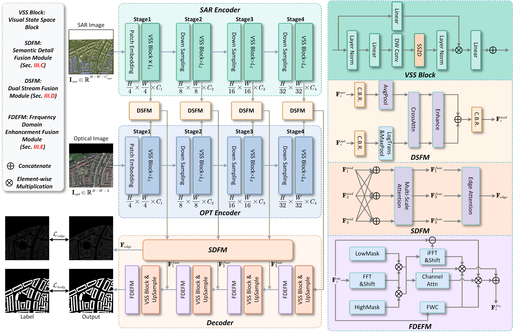

<p align="center">
  
</p>

# ✦ SSDFNet


Official PyTorch implementation of **SSDFNet** from the paper:

**SSDFNet: A State Space Guided Network for Multimodal Building Extraction and Solar Modeling**  
IEEE Journal of Selected Topics in Applied Earth Observations and Remote Sensing (JSTARS), Vol. 19, 2026, pp. 16623-16644.  
DOI: `10.1109/JSTARS.2026.3689074`

This repository focuses on **Optical + SAR multimodal building extraction** (building footprint / rooftop mask segmentation). The downstream solar/PV modeling experiments described in the paper are **not** included in this code release unless explicitly provided elsewhere.

- License (code): Apache-2.0 (see `LICENSE`)
- This codebase is built on top of the **ChangeMamba** / **VMamba** ecosystem.

---

## Highlights

SSDFNet is an encoder-decoder multimodal fusion framework for Optical-SAR building extraction.

Key ideas (as described in the paper):

- **State Space backbone (VMamba / VSSM)** for efficient long-range dependency modeling with (approx.) linear complexity.
- **SDFM** (Semantic Detail Fusion Module): injects high-level semantics into high-resolution features for finer structural delineation.
- **DSFM** (Dual Stream Fusion Module): aligns heterogeneous Optical vs SAR representations for robust cross-modal fusion.
- **FDEFM** (Frequency Domain Enhancement Fusion Module): reduces decoder aliasing and improves boundary/topology via frequency decomposition and recombination.
- **Boundary supervision**: an auxiliary edge head is trained alongside the building mask.

---

## Repository Layout

- `buildingextraction/`: SSDFNet building extraction pipeline
- `buildingextraction/models/`: SSDFNet model + fusion/decoder modules
- `buildingextraction/script/train_SSDFNet.py`: training entry
- `buildingextraction/script/infer_SSDFNet.py`: inference + metric evaluation
- `classification/`: VMamba/VSSM backbone code (imported by SSDFNet)
- `kernels/selective_scan/`: CUDA extensions for selective scan (required for VMamba)
- `analyze/`: analysis utilities (FLOPs, ERF, etc.)

---

## Environment

### Tested / Recommended

- OS: Linux (recommended). Windows is not officially tested.
- Python: 3.10+
- PyTorch: 2.0+ with CUDA
- CUDA Toolkit (for compiling kernels): >= 11.6 (see `kernels/selective_scan/setup.py`)
- GPU: NVIDIA (paper uses RTX A6000)

### Install Dependencies (example)

Create an environment (conda is recommended):

```bash
conda create -n ssdfnet python=3.10 -y
conda activate ssdfnet
```

Install PyTorch (pick the wheel matching your CUDA):

```bash
# Example (CUDA 11.8)
pip install torch torchvision torchaudio --index-url https://download.pytorch.org/whl/cu118
```

Install python packages:

```bash
pip install -U pip
pip install "numpy<2" yacs pyyaml timm einops fvcore tqdm pillow opencv-python imageio tifffile rasterio packaging ninja
pip install triton
```

Notes:

- `rasterio` is easiest via conda-forge if pip install fails:
  - `conda install -c conda-forge rasterio -y`
- `numpy<2` is recommended if you see binary-compat warnings in your environment.

---

## Build CUDA Kernels (Selective Scan)

VMamba/VSSM relies on CUDA selective-scan extensions. Build them once:

```bash
pip install -v -e kernels/selective_scan
```

If you hit architecture / "no kernel image is available" issues, try setting the arch list before building, e.g.:

```bash
export TORCH_CUDA_ARCH_LIST="8.6"
pip install -v -e kernels/selective_scan
```

---

## IMPORTANT: Set `PYTHONPATH`

The training/inference scripts are plain python files under `buildingextraction/script/` and this repo is not packaged as a pip module. You must add the repo root to `PYTHONPATH`.

Linux/macOS:

```bash
export PYTHONPATH="$(pwd):$PYTHONPATH"
```

Windows (PowerShell):

```powershell
$env:PYTHONPATH = "$PWD;$env:PYTHONPATH"
```

Quick sanity check:

```bash
python -c "import buildingextraction, classification; print('PYTHONPATH OK')"
```

---

## Data Preparation

### Expected Folder Structure

This implementation expects a dataset root with `train/`, `val/`, `test/` splits and **text files** listing sample ids.

Each sample id corresponds to these files:

- Optical image: `rgb/<id>.tif`
- SAR image: `sar/<id>.tif`
- Building mask: `masks/<id>.tif`
- Boundary mask: `boundary/<id>.tif`

Expected structure:

```text
DATA_ROOT/
  train.txt
  val.txt
  test.txt
  train/
    rgb/
      000001.tif
    sar/
      000001.tif
    masks/
      000001.tif
    boundary/
      000001.tif
  val/
    rgb/ ...
    sar/ ...
    masks/ ...
    boundary/ ...
  test/
    rgb/ ...
    sar/ ...
    masks/ ...
    boundary/ ...
```

Data notes (current loader behavior in `buildingextraction/datasets/make_data_loader.py`):

- Optical is loaded and converted to RGB.
- SAR is loaded from tif; if SAR is single-channel, it will be replicated to 3 channels.
- Masks/boundary are expected to be single-channel labels.
- Images/labels are resized to `512 x 512` inside the dataset loader.

### Generate `boundary/` From `masks/` (if needed)

If your dataset does not provide boundary labels, you can generate a thin boundary mask from the building mask using morphological gradient:

```python
import cv2
import numpy as np
from pathlib import Path
from PIL import Image

def make_boundary(mask_u8, k=3):
    kernel = np.ones((k, k), np.uint8)
    b = cv2.morphologyEx(mask_u8, cv2.MORPH_GRADIENT, kernel)
    return b

split_dir = Path("DATA_ROOT/train")  # change to train/val/test
mask_dir = split_dir / "masks"
out_dir  = split_dir / "boundary"
out_dir.mkdir(parents=True, exist_ok=True)

for p in mask_dir.glob("*.tif"):
    m = np.array(Image.open(p))
    m = (m > 0).astype(np.uint8) * 255
    b = make_boundary(m, k=3)
    Image.fromarray(b).save(out_dir / p.name)
```

---

## Training

Entry: `buildingextraction/script/train_SSDFNet.py`

This script:

- trains SSDFNet
- evaluates on the `test` split each epoch (used as validation in code)
- saves the best IoU checkpoint

Example (DFC-like dataset):

```bash
export PYTHONPATH="$(pwd):$PYTHONPATH"

python buildingextraction/script/train_SSDFNet.py \
  --cfg buildingextraction/configs/vssm1/vssm_tiny_224_0229flex.yaml \
  --pretrained_weight_path /path/to/vmamba_pretrained.pth \
  --dataset DFC23 \
  --train_dataset_path /path/to/DATA_ROOT \
  --train_data_list_path /path/to/DATA_ROOT/train.txt \
  --test_dataset_path /path/to/DATA_ROOT \
  --test_data_list_path /path/to/DATA_ROOT/test.txt \
  --batch_size 8 \
  --epochs 200 \
  --learning_rate 1e-4 \
  --weight_decay 5e-3 \
  --model_param_path ./saved_models
```

Outputs:

- Checkpoints are saved under:
  - `./saved_models/<dataset>/<model_type>_<timestamp>/epoch{E}_{IoU}_model.pth`

Notes:

- `--pretrained_weight_path` is for the VSSM backbone initialization (expects a checkpoint containing `model` key, see `Backbone_VSSM.load_pretrained`).
- `--resume` (optional) is for resuming a full SSDFNet `state_dict` saved by this training script.

---

## Inference / Evaluation

Entry: `buildingextraction/script/infer_SSDFNet.py`

Example:

```bash
export PYTHONPATH="$(pwd):$PYTHONPATH"

python buildingextraction/script/infer_SSDFNet.py \
  --cfg buildingextraction/configs/vssm1/vssm_tiny_224_0229flex.yaml \
  --pretrained_weight_path /path/to/vmamba_pretrained.pth \
  --dataset DFC23 \
  --test_dataset_path /path/to/DATA_ROOT \
  --test_data_list_path /path/to/DATA_ROOT/test.txt \
  --resume /path/to/ssdfnet_state_dict.pth \
  --result_saved_path ./results
```

Outputs:

- Predicted masks are saved to:
  - `./results/<dataset>/<model_type>/building_map_GT/*.png`
- Console prints IoU / F1 / Precision / Recall computed by `buildingextraction/utils_func/metrics.py`.

---

## Paper Results (IoU)

Reported in the paper abstract:

- DFC23 Track 2: 85.31
- MSAW: 80.70
- INRIA (optical-only): 84.38
- Singapore Optical-SAR rooftop dataset (constructed by authors): 80.41

---

## Citation

If you use this code in your research, please cite:

```bibtex
@article{tan2026ssdfnet,
  title   = {SSDFNet: A State Space Guided Network for Multimodal Building Extraction and Solar Modeling},
  author  = {Tan, Yonghui and Chen, Yumin and Zhu, Rui and Wong, Man Sing and Zhang, Xuequan and Ran, Tiantian and Zhu, Daoyong},
  journal = {IEEE Journal of Selected Topics in Applied Earth Observations and Remote Sensing},
  year    = {2026},
  volume  = {19},
  pages   = {16623--16644},
  doi     = {10.1109/JSTARS.2026.3689074}
}
```

---

## Acknowledgements

- This repository is built upon the **ChangeMamba** codebase and its VMamba/VSSM backbone ecosystem:
  - https://github.com/ChenHongruixuan/ChangeMamba
- VMamba selective-scan CUDA kernels are included under `kernels/selective_scan/`.
- Swin-Transformer / ConvNeXt style training/config utilities are referenced in parts of the codebase.

---

## Contact

- Yonghui Tan: `tanyh25@whu.edu.cn`
